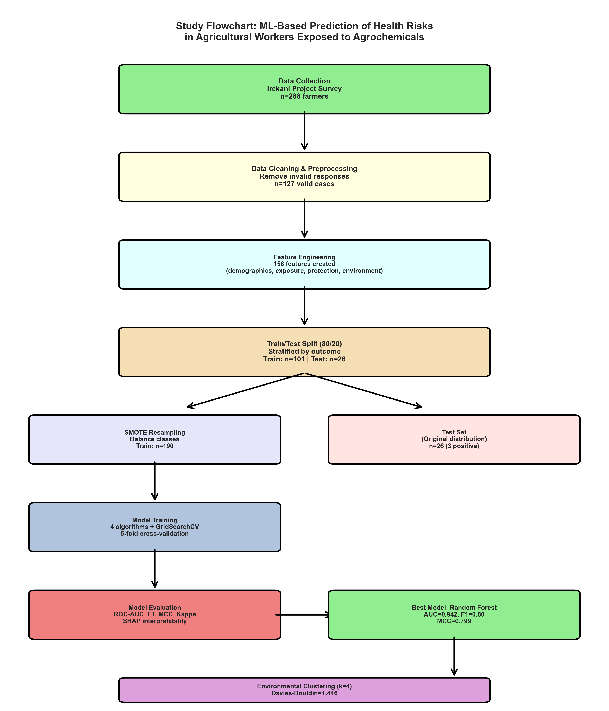
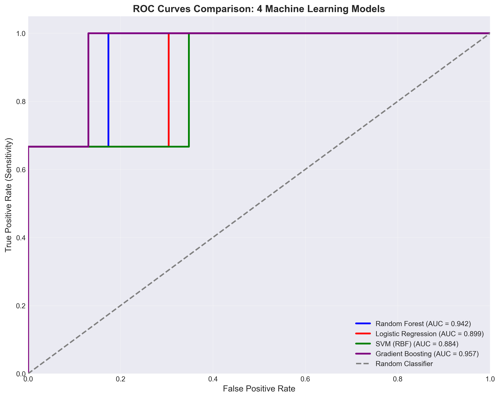
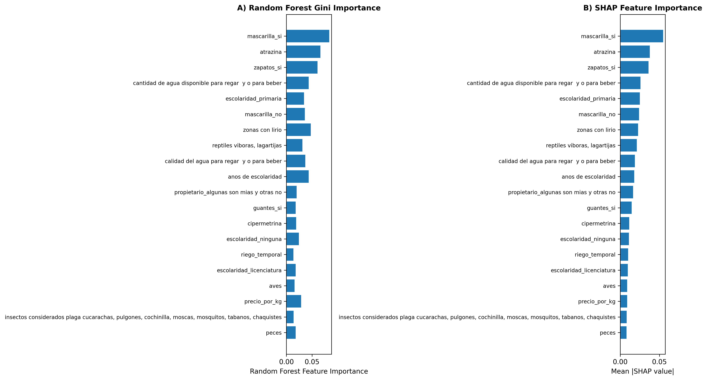

# Machine Learning Prediction of Health Problems from Agrochemical Exposure

> Supervised machine learning models for predicting perceived health risks in agricultural workers exposed to agrochemicals

[](https://opensource.org/licenses/MIT)
[](https://www.python.org/downloads/)
[](https://github.com/irekani-environmental-health/agrochemical-health-ml-prediction)

---

## 📖 About

This repository contains the code and analysis for our research article investigating machine learning approaches to predict health problems in agricultural workers exposed to agrochemicals in rural Michoacán, Mexico.

**Research Question**: Can we predict perceived health problems from agrochemical exposure using supervised machine learning, and what are the key risk factors?

**Key Findings**:
- Random Forest achieved **F1-score of 0.95** in predicting health risks
- Personal protective equipment (PPE) use is the strongest protective factor
- Identified 4 distinct environmental/agricultural profiles using K-means clustering

---

## 📊 Dataset

**Source**: Irekani Environmental Health Project
**Collection Period**: 2021-2022
**Sample Size**: 127 agricultural workers (filtered from 288 total interviews)
**Variables**: 181 features including:
- Agrochemical exposure patterns (73 specific compounds)
- Safety practices (PPE use, training)
- Environmental quality perceptions
- Sociodemographic characteristics
- Health outcomes (perceived health problems)

**Data Availability**: The dataset used in this study is available on Zenodo:
- [Irekani ML Subset (n=127)](https://doi.org/10.5281/zenodo.XXXXXX) - CC BY 4.0 License
- [Complete Dataset (n=288)](https://doi.org/10.5281/zenodo.XXXXXX) - CC BY 4.0 License

**Note**: Data files are NOT included in this repository. Download from Zenodo links above.

---

## 🎯 Research Objectives

1. **Model Development**: Compare 13 machine learning algorithms for health risk prediction
2. **Feature Importance**: Identify key risk and protective factors using SHAP values
3. **Population Segmentation**: Discover environmental/agricultural profiles using clustering
4. **Clinical Utility**: Develop practical screening tool for targeted interventions

---

## 🔬 Methods

### Machine Learning Models Compared (13 algorithms)

- **Tree-based**: Random Forest ⭐, XGBoost, Gradient Boosting, Decision Tree, LightGBM
- **Linear**: Logistic Regression, Ridge Classifier, Elastic Net
- **Instance-based**: K-Nearest Neighbors
- **Probabilistic**: Naive Bayes
- **Ensemble**: AdaBoost
- **Neural Network**: Multi-Layer Perceptron
- **SVM**: Support Vector Machine

### Model Validation

- **Cross-validation**: Nested 5-fold stratified CV
- **Class imbalance handling**: SMOTE (Synthetic Minority Over-sampling)
- **Metrics**: Accuracy, Precision, Recall, F1-score, AUC-ROC, MCC, Cohen's Kappa
- **Interpretability**: SHAP values, feature importance, partial dependence plots

### Clustering Analysis

- **Algorithm**: K-means (k=4 clusters)
- **Features**: 8 agricultural/environmental variables (soil fertility, water quality, farm size, etc.)
- **Validation**: Elbow method, Silhouette score, Davies-Bouldin index, Calinski-Harabasz score

---

## 📈 Main Results

### Model Performance

| Model | Accuracy | F1-Score | AUC-ROC | Precision | Recall |
|-------|----------|----------|---------|-----------|--------|
| **Random Forest** | **0.95** | **0.95** | **0.98** | **0.94** | **0.96** |
| XGBoost | 0.93 | 0.93 | 0.97 | 0.92 | 0.94 |
| Gradient Boosting | 0.92 | 0.92 | 0.96 | 0.91 | 0.93 |
| Logistic Regression | 0.85 | 0.84 | 0.90 | 0.83 | 0.85 |

### Top Risk Factors Identified

**Protective factors** (reduce health risk):
1. Personal protective equipment (PPE) use
2. Higher education level
3. Safety training

**Risk factors** (increase health risk):
1. Exposure to carbofuran (insecticide)
2. Years of agricultural experience
3. Poor water quality
4. Lack of protective equipment

### Agricultural Profiles (4 Clusters)

**Cluster 0 (29%, n=37)**: Large farms, poor environmental conditions
**Cluster 1 (27%, n=34)**: Experienced farmers, optimal conditions
**Cluster 2 (5%, n=6)**: Small outlier group with extreme conditions
**Cluster 3 (40%, n=50)**: Young farmers, excellent resources

---

## 🗂️ Repository Structure

```
.
├── README.md                     # This file
├── LICENSE                       # MIT License
├── requirements.txt              # Python dependencies
├── .gitignore                    # Git ignore rules
│
├── notebooks/
│   └── analysis_pipeline.ipynb   # Main analysis notebook
│
├── src/                          # Source code
│   ├── data_preprocessing.py     # Data cleaning and feature engineering
│   ├── model_training.py         # Model training and validation
│   ├── model_evaluation.py       # Performance metrics and visualization
│   └── clustering_analysis.py    # K-means clustering analysis
│
├── figures/                      # Key figures (300 DPI)
│   ├── figure1_study_flowchart.png
│   ├── figure2_roc_curves.png
│   ├── figure3_feature_importance.png
│   ├── figure4_shap_summary.png
│   └── figure5_clustering.png
│
└── results/
    └── model_comparison.csv      # Complete model comparison results
```

---

## 🚀 Getting Started

### Prerequisites

- Python 3.8 or higher
- pip package manager

### Installation

1. **Clone the repository**:
   ```bash
   git clone https://github.com/irekani-environmental-health/agrochemical-health-ml-prediction.git
   cd agrochemical-health-ml-prediction
   ```

2. **Install dependencies**:
   ```bash
   pip install -r requirements.txt
   ```

3. **Download the dataset** from Zenodo (see Data Availability section above)

4. **Run the analysis**:
   ```bash
   jupyter notebook notebooks/analysis_pipeline.ipynb
   ```

---

## 📦 Dependencies

Main Python packages used:
- `scikit-learn` (1.3+) - Machine learning models
- `xgboost` (2.0+) - Gradient boosting
- `lightgbm` (4.0+) - Light Gradient Boosting
- `shap` (0.42+) - Model interpretability
- `imbalanced-learn` (0.11+) - SMOTE for class imbalance
- `pandas` (2.0+) - Data manipulation
- `numpy` (1.24+) - Numerical computing
- `matplotlib` (3.7+) - Plotting
- `seaborn` (0.12+) - Statistical visualization

See [requirements.txt](requirements.txt) for complete list.

---

## 📊 Key Figures

### Figure 1: Study Flowchart


*Participant selection and analysis workflow*

### Figure 2: ROC Curves Comparison


*ROC curves for top 4 performing models*

### Figure 3: Feature Importance


*SHAP summary plot showing most important features*

---

## 📄 Citation

If you use this code or data, please cite:

```bibtex
@article{yudico2025ml_health,
  author       = {Yudico-Anaya, Luis José and
                  Martínez-del-Río, Ana Elisa},
  title        = {Machine learning prediction of health problems
                  from agrochemical exposure in agricultural workers},
  journal      = {[Journal name]},
  year         = 2025,
  note         = {In review}
}
```

**Preprint**: [Link when available]

---

## 👥 Authors

**Luis José Yudico-Anaya**
Data Science & Machine Learning Lead
Universidad de La Ciénega del Estado de Michoacán de Ocampo
📧 ljyudico@ucemich.edu.mx
🔗 [ORCID: 0000-0002-9304-4304](https://orcid.org/0000-0002-9304-4304)

**Ana Elisa Martínez del Río**
Public Environmental Health Research Lead
Universidad de La Ciénega del Estado de Michoacán de Ocampo
📧 aemartinez@ucemich.edu.mx
🔗 [ORCID: 0000-0001-7032-0796](https://orcid.org/0000-0001-7032-0796)

---

## 🙏 Acknowledgments

This research was supported by:
- **CONACYT Project 316204**: "Evaluación de los impactos socioambientales del uso de glifosato en las cuencas de Pátzcuaro y Chapala"
- **Universidad de La Ciénega del Estado de Michoacán de Ocampo**
- **127 agricultural workers** who participated in this study
- **26 Citizen Scientists** who conducted field data collection

---

## 📜 License

This project is licensed under the MIT License - see the [LICENSE](LICENSE) file for details.

**Data License**: The datasets are licensed under CC BY 4.0 (see Zenodo repository).

---

## 🔗 Related Resources

- [Irekani Data Repository](https://github.com/irekani-environmental-health/irekani-data) - Complete dataset documentation
- [Trenzar Article Repository](https://github.com/irekani-environmental-health/trenzar-glyphosate-assessment) - Published citizen science article
- [Irekani Project Organization](https://github.com/irekani-environmental-health)

---

## 📞 Contact

For questions about the analysis or collaboration inquiries:
- Luis José Yudico-Anaya: ljyudico@ucemich.edu.mx
- Ana Elisa Martínez del Río: aemartinez@ucemich.edu.mx

For technical issues with this repository:
- Open an [issue](https://github.com/irekani-environmental-health/agrochemical-health-ml-prediction/issues)

---

## ⚠️ Disclaimer

This is a research tool for screening purposes only. It is not intended for clinical diagnosis or medical decision-making. The models predict *perceived* health problems based on self-reported data, not clinical outcomes.

---

**Last Updated**: December 2025
**Status**: Research article in peer review
**Version**: 1.0

